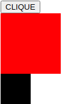
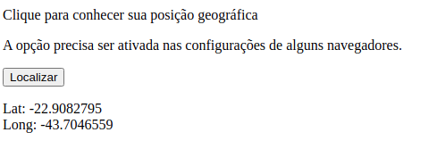

## Exemplo de JS


## Exemplo de jquery





## Exemplo de html, css e js


## Troca de imagem ao clickar


## Localização geográfica



# Principais palavras-chave da linguagem Javascript

| PALAVRA-CHAVE | DESCRIÇÃO |
| ------ | ------ |
| `break` | Encerra a execução de um laço.|
| `Continue` | Reinicia um laço, retornando ao seu início. |
| `debugger`| Interrompe a execução de um código Javascript para verificação |
|`do ... while` | Laço de repetição que executa ao menos uma iteração para depois verificar a condição imposta em WHILE |
| `for` | Laço de repetição com uma quantidade definida de iterações controlado por uma variável de controle. |
| `function` |Declaração de um função. |
| `if ... else` | Comando de decisão que pode ter mais de uma alternativa de execução dependendo das condições IF. |
| `return` | Comando de retorno do resultado de uma função. |
| `switch` | Comando de decisão onde são analisados possíveis valores de uma variável para escolha dos comandos a executar. |
| `try ... catch` | Comandos de tratamento de erros em blocos de comandos.|
| `var` |Define a declaração de uma variável. |

# Operadores da linguagem Javascript

| PALAVRA-CHAVE | DESCRIÇÃO |
| ------ | ------ |
| `+` | Adição|
| `-` | Subtração |
| `*`| Multiplicação |
|`/` | Divisão |
| `%` | Módulo |
| `++` | Incremento |
| `--` | Decremento |
| `==` | Igualdade |
| `===` | Igualdade de valor e tipo de dado |
| `!=` | Diferente|
| `!==` | Diferente valor ou tipo de dado |
| `>` | Maior que |
| `<` | Menor que |
| `>=` |Maior ou igual a |
| `<=` | Menor ou igual a |

## Instalação Jquery
```
yarn add jquery
```

```
npm install jquery
```

```
bower install jquery
```
```
bower install https://code.jquery.com/jquery-3.6.0.min.js
```