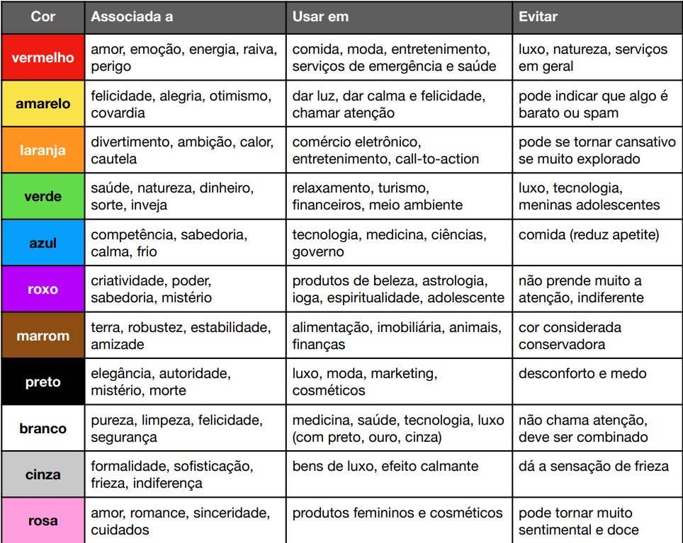
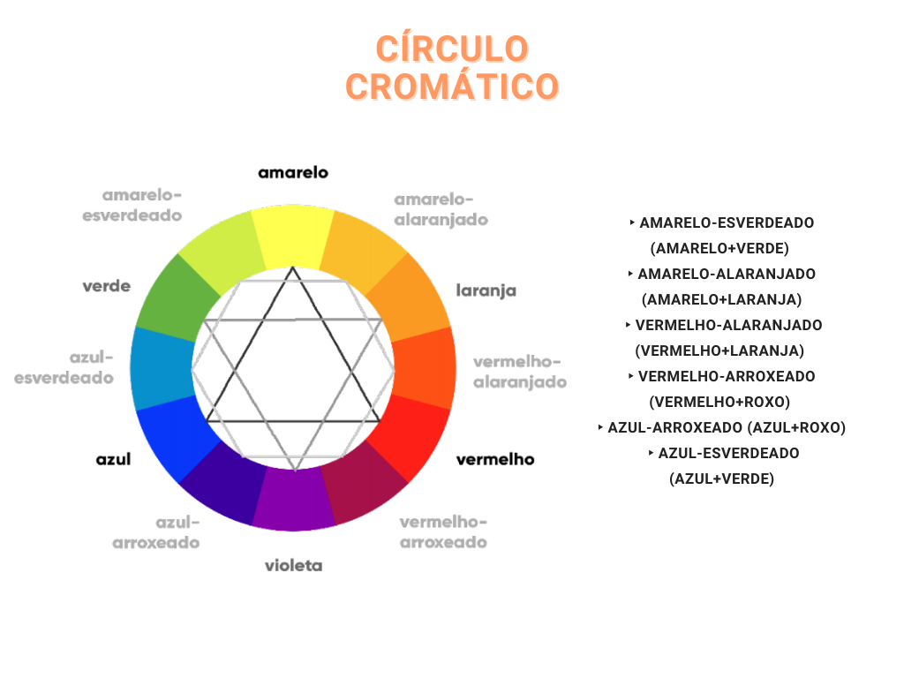
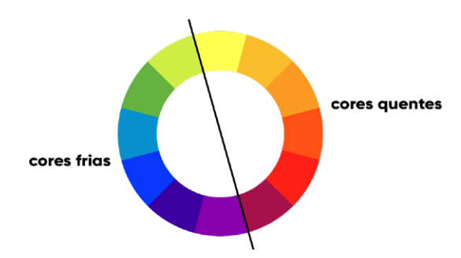
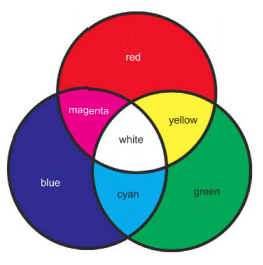
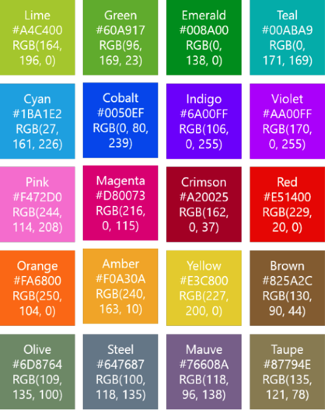

# Tópicos

* ### [Comandos essenciais](#Comandos-css)
* ### [Inserir CSS no documento](#Inserir-CSS-no-documento)
* ### [Fontes css](#Ter-diferentes-medidas-para-ajustar-tamanho-de-fonte-é-útil)
* ### [Cores](#Cores)

   
           
# Comandos CSS

## Comandos essenciais
| Comandos | Significado |        
| ------ | ------ |
| `background` |Ajusta todas as propriedades de fundo de uma vez |
| `background-color` | Ajusta as propriedades da cor de fundo |
| `background-image` |Ajusta as propriedades da imagem de fundo. |
| `background-repeat` | Ajusta as propriedades da repetição da imagem de fundo. |
| `background-attachment` |  Ajusta as propriedades da rolagem da imagem de fundo. |
| `background-position` |Ajusta as propriedades da posição da imagem de fundo. |
| `border` | Ajusta todas as propriedades de borda de uma vez |
| `border-bottom` | Ajusta as propriedades de borda de baixo de uma vez -**color** – ajusta a cor da borda -**style** – ajusta o tipo da linha de borda -**width** – ajusta a largura da linha de borda|
| `border-top` | Ajusta as propriedades de borda de cima de uma vez -**color** – ajusta a cor da borda -**style** – ajusta o tipo da linha de borda -**width** – ajusta a largura da linha de borda |
| `border-left` | Ajusta as propriedades de borda da esquerda de uma vez -**color** – ajusta a cor da borda -**style** – ajusta o tipo da linha de borda -**width** – ajusta a largura da linha de borda |
| `border-right` | Ajusta as propriedades de borda da direita de uma vez -**color** – ajusta a cor da borda -**style** – ajusta o tipo da linha de borda -**width** – ajusta a largura da linha de borda. |
| `margin` | Ajusta todas as bordas do elemento de uma vez |
| `margin-top` | Ajusta as margens de cima do elemento |
| `margin-right` | Ajusta as margens da direita do elemento. |
| `margin-bottom` |  Ajusta as margens de baixo  do elemento |
| `margin-left` | Ajusta as margens da esquerda do elemento. |
| `padding` |Ajusta o espaçamento entre borda e conteúdo |
| `padding-top` | Ajusta o espaçamento entre borda de cima e conteúdo |
| `padding-right` | Ajusta o espaçamento entre borda da direita e conteúdo. |
| `padding-bottom` |  Ajusta o espaçamento entre borda de baixo e conteúdo. |
| `padding-left` | Ajusta espaçamento entre borda da esquerda e conteúdo |
| `color` |  Ajusta a cor do texto de um elemento (texto, tabela, etc.) |
| `text-align` | Ajusta o espaçamento horizontal do texto de um elemento |
| `text-decoration` | Permite destacar textos com linhas usando as opções: **overline**: linha sobre **line-through**: linha riscando o texto;**underline**: linha abaixo do texto |
| `text-transform` | Modifica os caracteres do texto usando as opções: **uppercase**: maiúsculas; **lowercase**: minúsculas; **capitalize**: letra capitular |
| `line-height` | Ajusta o espaçamento entre linhas de texto |
| `text-shadow` | Adiciona o efeito de sombra a um texto. |
| `font-family` | Permite a escolha de fontes para texto |
| `font-style` | Ajusta efeitos entre texto normal ou italic (itálico) |
| `font-weight` | Ajusta efeitos entre texto normal ou bold (negrito) |
| `a:link` | Comando para configurar estilos para links não clicados |
| `a:visited` | Comando para configurar estilos para links já clicados. |
| `a:hover` | Comando para configurar estilos quando mouse em link|
| `a:active` | Comando para configurar estilos quando link é clicado |
| `list-style-type` | Seletor para criar tópicos em listas usando opções como:square (quadrado), circle (círculo), upper-roman (números romanos), lower-alpha (letras) |
| `list-style-image` |Utiliza imagens gravadas como marcadores em listas |

## Comandos complementares
| Comandos | Significado |        
| ------ | ------ |
| `border` | Ajusta bordas para tags `<table>`, `<th>` e `<td>` em tabelas|
| `border-collapse` | Esse seletor permite deixar a borda simples (‘collapse’)|
| `width` | Seletor para largura de elementos (tabela, div -% ou px) |
| `height` | Seletor para altura de elementos (tabela, div - % ou px) |
| `vertical-align` |  Assim como text-align, ajusta posição do texto (vertical) |
| `padding` | Seletor para ajuste da distância entre borda e texto |
| `outline` | Seletor para estilo, largura e cor de linha ao redor de div |
| `outline-style` | Define estilo de linha ao redor de um box (div), usando **dotted** (pontilhada),**dashed** (tracejada), **solid** (simples),**double** (dupla), **groove**, **ridge**, **inset**, **outset** (bordas 3d), **none** (nenhuma), **hidden** (oculta). |
| `outline-width` | Seletor para a largura da linha ao redor da div|
| `outline-color` | Seletor para a cor da linha ao redor da div |
| `outline-width` | Seletor para a largura da linha ao redor da div|
| `max-width` | Seletor para definir limite máximo para largura de um div |
| `max-height` | Seletor para definir limite máximo para altura de um div |
| `min-width` | Seletor para definir limite mínimo para largura de um div |
| `min-height` | Seletor para definir limite mínimo para altura de um div |
| `z-index` | Seletor para posicionamento de objetos em camadas (-1) |
| `float` | Serve para posicionar elementos em relação a outros |
| `clear` | Seletor para anular o efeito do seletor float |
| `clear` | Seletor para anular o efeito do seletor float |
| `clearfix` | Classe que pode ser usada para ajustar elementos de forma a se organizarem com o parâmetro **overflow: auto**|
| `floating-box` | Caixas para alocar elementos soltos de tamanho variado|
| `after-box` | Limpa ajustes feitos por floating-box (**clear: left;**) |
| `margin` | Seletor para posicionamento de elementos (**margin: auto;**) |
| `position` | Seletor para posicionamento definido por parâmetros:  **position: absolute;** para dimensões e posição exatas; **position: relative;** para ajustes proporcionais a janela|
| `opacity` |Propriedade de transparência entre 0 e 1 (**opacity: 0.4;**)|

## Parametros adicionais para CSS 3

| Comandos | Significado |        
| ------ | ------ |
| `border-radius` | Propriedade para arredondamento de cantos pela ordem: **sup. esquerdo** , **sup.direito**, **inf. esquerdo**, **inf. direito** |
| `border-image` |Propriedade para uso de imagem para compor borda|
| `background-image` | Permite múltiplas imagens como fundo em camadas |
| `background-size` | Propriedade para ajustar o tamanho do plano de fundo (**background-size: contain;** ou **background-size: cover;**) |
| `background-origin` |  Propriedade para especificar a posição do plano de fundo **border-box**: Plano de fundo inicia no canto sup. esquerdo **padding-box**: Plano de fundo inicia dentro da borda **content-box**: Plano de fundo inicia junto com o texto |
| `background-clip` | Propriedade para especificar a posição da cor de fundo **border-box**: Cor de fundo inicia no canto sup. esquerdo **padding-box**: Cor de fundo inicia dentro da borda **content-box**: Cor de fundo inicia junto com o texto|
| `rgba` | Define cores e transparência (**cor**, **% saturação**, **% brilho**) 315º 360º/0º 45º 270º      90º 225º 180º 135º|
| `hsla` | Ajustes de **cor**, **saturação**, **luminosidade** e **transparência** em valores de *0* a *360*, *0%* a *100%*, *0%* a *100%* e *0* a *1* |
| `linear-gradient` | Propriedade de ajuste de background em gradiente linear Direção: **left-top**, **to bottom right**, **to right**, **to left**, etc (*0º a 360º*), *Cor inicial*, *Cor final* |
| `radial-gradient` | Propriedade de ajuste de background em gradiente radial Forma: **circle**, **closest-side**, **farthest-side**, **closest-corner**, **farthest-cor-ner**, **cores** (nome) e **porcentagens** (%)|
| `text-shadow` | Propriedade que cria sombra em texto com seus atributos *Distância horizontal*, *Distância vertical*, *efeito borrar*, *cor* |
| `box-shadow` | Cria uma sombra em caixas div (*tamanho*, *borrar*, *cor*) |
| `transform` | *Efeitos 2D* em elementos a partir de parâmetros diversos: **translate()** move o elemento horizontal e verticalmente (px) **rotate()** gira um elemento horário/anti-horário (deg ou –deg) **scale()** aumenta ou reduz o tamanho de um element (valor) **skewX()** inclina um element de acordo com o ângulo (deg) **skewY()** inclina um element de acordo com o ângulo (deg) **matrix()** agrupa todos os métodos acima em valores |
| `transform` | *Efeitos 2D* em elementos a partir de parâmetros diversos: **rotateX()** gira sobre o eixo central X o elemento (deg) **rotateY()** gira sobre o eixo central Y o elemento (deg) **rotateZ()** gira sobre o eixo central Z o elemento (deg) **translate3d()** define um movimento em 3D (x,y,z **scale3d()** aumenta ou reduz em 3D (x,y) **rotate3D** gira o elemento (x,y,z,ângulo **perspective()** visão perspectiva de um elemento (n) |
| `transition` | Ajuste de parâmetros para controlar efeitos de animação **transition: width 2s, height 4s;** (modifica largura e altura) |
| `transition-timing-function` | Ajustes no tempo de execução dos efeitos **ease**: início lento, accelerando e reduzindo no final **linear**: do início ao fim com a mesma velocidade **ease-in**: início lento da transição **ease-out**: final lento da transição **cubic-bezier(n,n,n,n)**: ajustes na curva de transição |
| `transition-delay` | Ajusta um tempo de espera para início da transição |
| `column-count` | Divide o conteúdo de um elemento em colunas (valor) |
| `column-gap` | Define a distância entre as colunas definidas (px) |
| `column-rule-style` | Define o estilo da linha divisória entre colunas (solid) |
| `column-rule-width` | Define a espessura da linha divisória entre colunas (px) |
| `column-rule-color` | Define a cor da linha divisória entre colunas (nome) |
| `column-rule` | Agrupa as definições para divisão de elementos em colunas|
| `column-span` |Mescla colunas divididas **(column-span: all;)**|
| `column-width` | Especifica a largura preferencial para colunas (px)|
| `filter` | Seletor para ajuste de filtros para tratamento de imagens. **None**: retira efeitos ativados **blur()**: Embaça a imagem (%) **brightness()**: Brilho da imagem (%) **contrast()**: Ajusta contraste (%) **drop-shadow()**: Sombra  na imagem (Horiz, Vert, blur, cor) **grayscale()**: Converte a imagem em tons de cinza (%) **hue-rotate()**: Matiz da imagem (deg) |
| `filter` | **invert()**: Inverte as cores da imagem no estilo negative (%) **opacity()**: Transparência da imagem (%) **saturate()**: Saturação da imagem (%) **sepia()**: Converte a imagem no estilo envelhecida (%) |


Em geral, os comandos CSS são chamados seletores e seguem uma sintaxe como a do exemplo a seguir:
`SELETOR {PROPRIEDADE:VALOR; PROPRIEDADE:VALOR;}`

# <a name="Inserir CSS no documento">Inserir CSS no documento</a>

Um arquivo contendo os seletores de estilo CSS deve ser gravado em um arquivo de texto com a extensão .CSS e deve ser adicionado a um código HTML por meio da tag `<LINK>`, dentro do cabeçalho `<HEAD>`, como no exemplo:
```
        <head>
               <link rel=”stylesheet” type=”text/css” href=”estilo.css”>
        </head> 
```

É possível também utilizar um estilo CSS para configurar apenas uma tag html, tendo validade, apenas, enquanto a tag estiver ativa, como no exemplo a seguir:

```
 <h1>style=”color:blue;margin-left:30px;”>Texto</h1>
```
 
 HTML5 introduziu um método para permitir que web designers possam as-sumir o controle sobre a janela de exibição, por meio do `<meta>` tag.
    Você deve incluir o elemento `<meta>` dentro da área de cabeçalho `<HEAD>` para indicar as propriedades de exibição em todas as suas páginas web:
```
 <meta name=”viewport” content=”width=device-width, initial-scale=1.0”>
```
 Um `<meta>` elemento viewport dá as instruções do navegador sobre como controlar dimensões e escalonamento da página.
    A largura = largura do dispositivo parte define a largura da página a seguir à tela de largura do dispositivo (que irá variar dependendo do dispositivo).
    A escala inicial = 1,0 parte define o nível de zoom inicial, quando a página é carregada pela primeira vez pelo browser.
    
## Ter diferentes medidas para ajustar tamanho de fonte é útil?

Imagine um site mobile ou um site para telas maiores ou projeções. Ao invés de você mudar as fontes para cada elemento, é possível ajustar diretamente o tamanho da fonte padrão para cada tag HTML de texto.

Exemplo de código para ajuste de tamanho da fonte

```
body {font: 100% verdana, arial, sans-serif;}

h1{  font-size: 2.50em;}

h2{  font-size: 1.50em;}

p{  font-size: 0.8em;}
```
> Fonte:Unicesumar

Mudando o valor de porcentagem da FONT do elemento BODY, proporcionalmente, a fonte e todo conteúdo padrão da página são ajustados.

Outra unidade chamada REM também pode ser utilizada para referenciar ta-manho de fonte e funciona de maneira proporcional a medidas em pixels. A figura 11 mostra um exemplo de código utilizando essa unidade de medida.

Exemplo de código para ajuste de tamanho da fonte
```
body {font: 100% verdana, arial,sans-serif;}
h1 {  font-size: 3.00rem;}
h2 {  font-size: 2.00rem;}
p {  font-size: 1.50rem;}
```
> Fonte: Unicesumar

Alguns  navegadores  podem  ter  problemas  com  essas  unidades,  mas  isso  ocorre  mais  com  navegadores  antigos,  em  que  é  interessante  o  uso  de  PX  ou porcentagem mesmo como unidade padrão.

# Cores

## Emoção das cores


## Círculo cromático


## Esquemas harmônicos


## Temperatura e harmonia


## Combinação de cores


## Cores RGB e Hex



