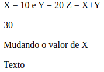
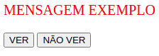

# Tòpicos

[Strings](#strings)

[Incrementar e Decrementar](#incrementar-e-decrementar)

[Operadores da Linguagem Javascript](#operadores-da-linguagem-javascript)

[Operadores de Atribuição](#operadores-de-atribuição)

[Operadores Lógicos](#operadores-lógicos)

[Operador Condicional Ternário](#operador-condicional-ternário)

[Operadores de Strings](#operadores-de-string)

[Loop For](#loop-for)

[Funções Javascript](#funções-javascript)

[Caixa de Alerta](#caixa-de-alerta)

[Caixa de Prompt](#caixa-de-prompt)

[Caixa de confirmação](#caixa-de-confirmação)

[Objetos](#objetos)

[Objetos Principais](#objetos-principais)

[Doom]()
# Strings

Em JavaScript podemos usarVamos começar simples embora. Os números podem ser escritos com ou sem decimais. Como isso: strings para armazenar e manipular texto.

Uma string pode ser qualquer texto entre aspas . Aspas simples ou duplas, não importa, desde que você seja consistente com elas. Como isso:

```js
var nome = 'João';
var text = "Meu nome é John Smith";
```

E se quisermos usar aspas dentro de uma string?? Sem problemas! Você pode usar aspas dentro de uma string, desde que elas não correspondam às aspas que envolvem a própria string. Dê uma olhada:
```js
var text = "Meu nome é 'João'";
```

Você pode obter aspas duplas dentro de aspas duplas usando o caractere de escape como este: \" ou \' dentro de aspas simples.

# Incrementar e Decrementar

"Espere, eu ouvi falar de um incremento, mas o que diabos é um decremento?" Ouvimos alguns de vocês dizerem. Bem, jogue um incremento no reverso e pronto, você terá um decréscimo. Vamos aprofundar um pouco mais... 

### Increment ++
O operador de incremento aumenta o valor numérico de seu operando em 1 . Quando colocado antes do operando, retornará o valor incrementado. Quando colocado depois dele, ele retornará o valor original e então incrementará o operando. 

### Decrement -- 

O operador de decremento diminui o valor numérico de seu operando em 1 . Quando colocado antes do operando, retornará o valor decrementado. Quando colocado após o operando, ele retornará o valor original e então diminuirá o operando.


# Operadores de Atribuição


**Atenção!**
Você pode usar vários operadores de atribuição em uma linha, como x -= y += 9.


# Operadores de Comparação


# Operadores Lógicos

Operadores Lógicos , também conhecidos como Operadores **Booleanos** , (ou os Operadores Vulcan….ok, esse não é true ) avaliam uma expressão e retornam true ou false . Confira a tabela abaixo para ver mais detalhes sobre os operadores lógicos ( AND , OR , NOT ).


# Operador condicional (ternário)

Os operadores Conditional ou Ternary atribuem um valor a uma variável, com base em alguma condição . Esta é a aparência da sintaxe:

```js
variável = (condição) ? valor1: valor2
```

```js
var isAdult = (idade < 18) ? "Jovem Demais" : "Velho o suficiente";
```
Se a variável idade for um valor abaixo de 18, o valor da variável isAdulto será "Jovem demais". Caso contrário, o valor de isAdult será "Old bastante".

# Operadores de String

Hora de apresentar o operador mais útil para cordas... rufar de tambores, por favor. ... Concatenação . Podemos usar a concatenação (representada pelo sinal **+**) para construir strings compostas de várias strings menores ou juntando strings com outros tipos. Confira:

```js
var mystring1 = "Estou aprendendo";
var mystring2 = "Javacript com Sololearn";
document.write(mystring1 + mystring2);
```

**Atenção**
Os números entre aspas são tratados como strings: então "42" não é o número 42, é uma string que inclui os dois caracteres separados, 4 e 2.

# Loop For

Se a instrução 2 retornar true, o loop começará novamente, se retornar false, o loop terminará.

A instrução 2 também é opcional, mas somente se você colocar uma quebra dentro do loop. Caso contrário, o loop nunca terminará!

A instrução 3 é usada para alterar a variável inicial. Ele pode fazer qualquer coisa, incluindo incremento negativo (i--), incremento positivo (i = i + 15).

A instrução 3 também é opcional, mas somente se você incrementar seus valores dentro do loop. Como isso:

```js
var i = 0;
for(; i<10;){
    document.write(i);
    i++;
}
```

# Funções JavaScript

Uma função JavaScript é um bloco de código projetado para executar uma tarefa específica.

As principais vantagens do uso de funções:

**Reutilização de código** : defina o código uma vez e use-o muitas vezes.
Use o mesmo código muitas vezes com argumentos diferentes para produzir resultados diferentes.

```js
function name(){
    //Código a ser executado
}

name();
```

## Parâmetros de função

As funções podem receber parâmetros . Parâmetros
de função são os nomes listados na definição da função. Sintaxe:

```js
functionName(param1, param2, param3){
    //algum código
}
```
```js
function sayHello(name){
    alert("Hi, " + name).
}
sayHello("David");
sayHello("Sarah);
```

## Multiplos Parâmetros

Você pode definir vários parâmetros para uma função separando-os por vírgula .

```js

function sayHello(nome,idade) {
  document.write( nome + " é " + idade + " anos de idade.");
}

sayHello("João", 20)
```

**Atenção**
Se uma função for chamada com argumentos ausentes (menos do que declarado), os valores ausentes serão definidos como undefined , o que indica que uma variável não recebeu um valor.

# Caixa de Alerta

O JavaScript oferece três tipos de caixas pop-up, as caixas **Alert** , **Prompt** e **Confirm**.

O método **prompt()** recebe dois parâmetros . - O primeiro é o rótulo, que você deseja exibir na caixa de texto. - A segunda é uma string padrão a ser exibida na caixa de texto (opcional). Exemplo:
Caixa de Alerta

Uma caixa de alerta é usada quando você deseja garantir que as informações cheguem ao usuário.
Quando uma caixa de alerta é exibida, o usuário deve clicar em OK para continuar.
A função de alerta usa um único parâmetro, que é o texto exibido na caixa pop-up.
Exemplo:


# Caixa de Prompt

Uma caixa de prompt geralmente é usada para que o usuário insira um valor antes de entrar em uma página.

Quando uma caixa de prompt aparecer, o usuário terá que clicar em OK ou Cancelar para continuar após inserir o valor de entrada.
Se o usuário clicar em OK, a caixa **retornará** **o valor de entrada**. Se o usuário clicar em Cancelar, a caixa retornará nulo.

O método **prompt()** recebe **dois parâmetros**.
- O primeiro é o rótulo, que você deseja exibir na caixa de texto.
- A segunda é uma string padrão a ser exibida na caixa de texto (opcional).

```js
var user = prompt("Please enter your name");
```


**Atenção**

Quando uma caixa de prompt aparecer, o usuário terá que clicar em "OK" ou "Cancelar" para continuar depois de inserir um valor de entrada. Não abuse desse método, pois ele impede que o usuário acesse outras partes da página até que a caixa seja fechada.

# Caixa de Confirmação

Uma **caixa de confirmação** é frequentemente usada para que o usuário verifique ou aceite algo.

Quando uma caixa de confirmação aparece, o usuário deve clicar em OK ou Cancelar para continuar.

Se o usuário clicar em OK, a caixa retornará **true**. Se o usuário clicar em Cancelar, a caixa retornará **false**.

Exemplo:

```js
var result = confirm("Do you realy want to leave this page?");
if (result == true){
    alert("Thanks for visiting);
}else{
    alert("Thanks for staying with us");
}
```


The result when the user clicks **OK**:


The result when the user clicks **Cancel**:


# Objetos

As variáveis JavaScript são contêineres para valores de dados. **Objetos** também são variáveis, mas podem conter muitos valores.

Pense em um objeto como uma lista de valores que são escritos como pares **nome:valor**, com os nomes e os valores separados por dois-pontos.
Exemplo:

```js
var person = {
    name: "John", 
    age:31,
    favColor: "green", 
    height:183
};
```
Os valores são chamados de propriedades


Objetos JavaScript são contêineres para valores nomeados .

## Propriedades do Objeto

Você pode acessar as propriedades do objeto de duas maneiras.

```js
objectName.propertyName
//ou
objectName['propertyName']
```

Este exemplo demonstra como acessar a idade do nosso objeto pessoa.

```js
var pessoa = {
    nome: "João",
    idade: 31,
    cor fav: "verde",
    altura: 183
};

var x = pessoa.idade;
var y = pessoa['idade'];
```

A propriedade **length** incorporada do JavaScript é usada para contar o número de caracteres em uma propriedade ou string.

```js
var curso = {nome: "JS", Lições: 41};
document.write(curso.nome.length);
```

Objetos são um dos conceitos centrais em JavaScript.

## Métodos de Objeto

Um **método** de objeto é uma propriedade que contém uma **definição de função** Incorporada do JavaScript

Use a sintaxe a seguir para acessar um método de objeto.

```js
objectName.methodName()
```

Como você já sabe, document.write() gera dados. A função **write**() é na verdade um método do objeto de documento.

```js
document.write("Isto é algum texto");
```

Métodos são funções que são armazenadas como propriedades de objetos.

## Construtor de Objetos

Na lição anterior, criamos um objeto usando a sintaxe literal de objeto (ou inicializador).

```js
var person = {
name: "John", 
age: 42, 
favColor: "green"
};
```

Isso permite que você crie apenas um único objeto.
Às vezes, precisamos definir um **"tipo de objeto"** que pode ser usado para criar vários objetos de um único tipo.
A maneira padrão de criar um "tipo de objeto" é usar uma função **construtora de objeto**.

```js
function person(name, age, color) {
  this.name = name;
  this.age = age;
  this.favColor = color;
}
```

A função acima (person) é um construtor de objetos, que recebe parâmetros e os atribui às propriedades do objeto.

A palavra-chave **this** se refere ao objeto atual.
Observe que isso não é uma variável. É uma palavra-chave e seu valor não pode ser alterado.

## Criando Objetos

Depois de ter um construtor de objetos, você pode usar a palavra-chave **new** para criar novos objetos do mesmo tipo.

```js
var p1 = new person("John", 42 "green");
var p2 = new person("Amy", 21, "red");

document.write(p1.age); // Outputs 42
document.write(p2.name); // Outputs "Amy"
```
Considere o seguinte exemplo

```js
function person (name,age){
    this.name = name;
    this.age = age;
}

var John = new Person("John", 25);
var James = new Person("James", 21);

```
Acesse as propriedades do objeto usando a sintaxe de ponto , como você fez antes.


## Inicializando objetos

Use o **literal de objeto** ou a sintaxe do **inicializador** para criar objetos únicos.

```js
var John = {name: "John", age: 25};
var James = {name: "James", age: 21};
```

Objetos consistem em propriedades, que são usadas para descrever um objeto. Os valores das propriedades do objeto podem conter tipos de dados primitivos ou outros objetos.

Espaços e quebras de linha não são importantes. Uma definição de objeto pode abranger várias linhas.

```js
var John = {
  name: "John",
  age: 25
};

var James = { 
  name: "James",
  age: 21
};
```

Não importa como o objeto é criado, a sintaxe para acessar as propriedades e métodos não muda.

```js
document.write(John.idade);
```
Não se esqueça da segunda sintaxe de acesso: ```John['age']```.

## Métodos

Métodos são funções que são armazenadas como propriedades de objetos. Use a seguinte sintaxe para criar um método de objeto:

```js
nomedométodo = function() { linhas de código }
```

Acesse um método de objeto usando a seguinte sintaxe:

```
objectName.methodName()
```

Um método é uma função, pertencente a um objeto. Ele pode ser referenciado usando a palavra-chave this .

A palavra-chave this é usada como referência ao objeto atual, o que significa que você pode acessar as propriedades e métodos dos objetos usando-o. A definição de métodos é feita dentro da função construtora. Por exemplo:

```js
function person(name, age){
    this.name = name,
    this.age = age;
    this.changeName = function (name){
        this.name = name;
    }
}

var p = new person("David", 21);
p.changeName("John");
//Agora p.name = "John"
```

No exemplo acima, definimos um método chamado **changeName** para nossa pessoa, que é uma função, que recebe um nome de parâmetro e o atribui à propriedade name do objeto. this.name refere-se à propriedade name do objeto.

O método changeName altera a propriedade name do objeto para seu argumento.


Você também pode definir a função fora da função construtora e associá-la ao objeto.

```js
function person(name, age) {
  this.name= name;  
  this.age = age;
  this.yearOfBirth = bornYear;
}
function bornYear() {
  return 2016 - this.age;
}
```

Como você pode ver, atribuímos a propriedade **yearOfBirth** do objeto à função **bornYear** .A palavra-chave this é usada para acessar a propriedade age do objeto, que vai chamar o método.

Observe que não é necessário escrever os parênteses da função ao atribuí-la a um objeto.

Chame o método normalmente.

```js
function person(name, age){
    this.name = name;
    this.age = age;
    this.yearOfBirth = bornYear;
}

function bornYear(){
    return 2016 - this.age;
}

var p = new person("A", 22);
document.write(p.yearOfBirth());
```
**Atenção**
Chame o método pelo **nome da propriedade** que você especificou na função construtora, em vez do nome da função.

# Objetos Principais

## Matrizes JavaScript

**Arrays** armazenam vários valores em uma única variável. Para armazenar três nomes de curso, você precisa de três variáveis.

```js
var curso1 ="HTML"; 
var curso2 ="CSS"; 
var curso3 ="JS";
```

Mas e se você tivesse 500 cursos? A solução é uma **matriz**

```js
var cursos = new Array("HTML", "CSS", "JS");
```

Essa sintaxe declara uma matriz chamada cursos , que armazena três valores ou elementos.

## Acessando uma Matriz

Para armazenar três nomes de curso, você precisa de três variáveis.Você se refere a um elemento de array referindo-se ao número de **índice** escrito **entre colchetes**.
Esta instrução acessa o valor do primeiro elemento em cursos e altera o valor do segundo elemento.

```js
var courses = new Array("HTML", "CSS", "JS"); 
var course = courses[0]; // HTML
courses[1] = "C++"; //Changes the second element 
```
[0] é o primeiro elemento em uma matriz. [1] é o segundo. Os índices de matriz começam com 0.

Tentando acessar um índice fora do array, retorna o valor **undefined**

```js
var cursos = new Array("HTML", "CSS", "JS");
document.write(cursos[10]);
```
Nosso array de cursos tem apenas 3 elementos, então o 10º índice, que é o 11º elemento, não existe (é indefinido).

## Criando matriz

Você também pode declarar um array, informar o número de elementos que ele armazenará e adicionar os elementos posteriormente.

```js
var cursos = new Array(3);
cursos[0] = "HTML";
cursos[1] = "CSS";
cursos[2] = "JS";
```

Um array é um tipo especial de **objeto**.
Um array usa **números** para acessar seus elementos e um objeto usa **nomes** para acessar seus membros.

Arrays JavaScript são dinâmicos, então você pode declarar um array e não passar nenhum argumento com o construtor Array(). Você pode então adicionar os elementos dinamicamente.

```js
var cursos = new Array();
cursos[0] = "HTML";
cursos[1] = "CSS";
cursos[2] = "JS";
cursos[3] = "C++";
```

## Array Literal

Para maior simplicidade, legibilidade e velocidade de execução, você também pode declarar arrays usando a sintaxe literal de array .

```js
var cursos = ["HTML", "CSS", "JS"];
```
Isso resulta na mesma matriz que a criada com a nova sintaxe Array() .

Você pode acessar e modificar os elementos do array usando o número de índice, como fez antes.
A sintaxe literal de matriz é a maneira recomendada de declarar matrizes.

## Propriedade Length

Matrizes JavaScript têm propriedades e métodos internos úteis. A propriedade length de um array retorna o número de seus elementos.

```js
var cursos = ["HTML", "CSS", "JS"];
document.write(cursos.length);
//retorna 3
```

A propriedade length é sempre um a mais que o índice de array mais alto.
Se a matriz estiver vazia, a propriedade length retornará 0.

## Combinando Matrizes

JavaScript propriedades e métodos **concat()**
A propriedade **length** de um array retorna o número de seus elementos.
O método permite que você junte arrays e crie um array totalmente novo. Exemplo:

```js
var c1 = ["HTML", "CSS"];
var c2 = ["JS", "C++"];
var cursos = c1.concat(c2);

```
A matriz de cursos resultante contém 4 elementos (HTML, CSS, JS, C++).

A operação concat não afeta os arrays c1 e c2 - ela retorna a concatenação resultante como um novo array.

## Matrizes Associativas

Enquanto muitas linguagens de programação suportam arrays com índices nomeados (texto em vez de números), os chamados **arrays associativos** JavaScript não suportam . No entanto, você ainda pode usar a sintaxe de matriz nomeada, que produzirá um objeto. Por exemplo:

```js
var pessoa = []; //Array vazio
pessoa["nome"] = "João";
pessoa["idade"] = 46;
document.write(pessoa["idade"]);
```
Agora, pessoa é tratada como um objeto, em vez de ser um array.
Os índices nomeados "nome" e "idade" tornam-se propriedades do objeto pessoa.

Como o array pessoa é tratado como um objeto, os métodos e propriedades padrão do array produzirão resultados incorretos. Por exemplo, pessoa.length retornará 0.

Lembre-se de que JavaScript **não suporta** arrays com índices nomeados.
Em JavaScript, arrays sempre usam índices numerados.
É melhor usar um **objeto** quando quiser que o índice seja uma **string** (texto).
Use uma **matriz** quando quiser que o índice seja um **número**.

Se você usar um índice nomeado, o JavaScript redefinirá a matriz para um objeto padrão.

## O Objeto Math

O objeto Math permite realizar tarefas matemáticas e inclui várias propriedades.


Por exemplo:

```js
document.write(Math.PI);
```

O Math não tem construtor. Não há necessidade de criar um objeto Math primeiro.

## Métodos do Objeto Math
O objeto **Math** contém vários métodos que são usados ​​para cálculos:


Por exemplo, o seguinte calculará a raiz quadrada de um número.

```js
var num = Math.sqrt(4);
document.write(num);
```

**Atenção**
Para obter um número aleatório entre 1-10, use Math.random(), que fornece um número entre 0-1. Em seguida, multiplique o número por 10 e, em seguida, pegue Math.ceil() dele:

Math.ceil(Math.random() * 10).

## Exemplo do Objeto Math

Vamos criar um programa que pedirá ao usuário para inserir um número e alertar sua raiz quadrada.

```js
var n = prompt("Digite um número","");
var resp = Math.sqrt(n);
alert("A raiz quadrada de " +n+ " é " +resp);
```
Resultado:


digite um número, como 64.


A Math é um objeto útil. Você pode economizar muito tempo usando o Math, em vez de escrever suas próprias funções todas as vezes.

## Método setInterval

O método **setInterval()** chama uma função ou avalia uma expressão em intervalos especificados (em milissegundos).

Ele continuará chamando a função até que **clearInterval()** seja chamado ou a janela seja fechada. Por exemplo:

```js
function meuAlerta(){
    alert("Oi");
}

setInterval(meuAlerta, 3000);
```

Escreva o nome da função sem parênteses ao passá-lo para o método setInterval .
## Objeto Data

O método do objeto Date nos permite trabalhar com datas.

Uma data consiste em um ano, um mês, um dia, uma hora, um minuto, um segundo e milissegundos.

Por exemplo:
Usando **new Date()** , crie um novo objeto de data com a **data e hora atuais**

```js
var d = new Data();
//d armazena a data e hora atuais
```

As outras maneiras de inicializar datas permitem a criação de novos objetos de data a partir da **data e hora especificadas**

```js
new Date(milliseconds)
new Date(dateString)
new Date(year, month, day, hours, minutes, seconds, milliseconds)
```

As datas do JavaScript são calculadas em milissegundos a partir de 01 de janeiro de 1970 00:00:00 Universal Time (UTC). Um dia contém 86.400.000 milissegundos.


Por exemplo:

```js
//Fri Jan 02 1970 00:00:00
var d1 = new Date(86400000); 

//Fri Jan 02 2015 10:42:00
var d2 = new Date("January 2, 2015 10:42:00");

//Sat Jun 11 1988 11:42:00
var d3 = new Date(88,5,11,11,42,0,0);
```
JavaScript conta meses de 0 a 11. Janeiro é 0 e dezembro é 11.
Objetos de data são estáticos, em vez de dinâmicos. O tempo do computador está passando, mas os objetos de data não mudam, uma vez criados.

# Métodos de Data

Quando um objeto Date é criado, vários métodos tornam possível realizar operações nele.


Poe exemplo:

```js
var d = new Data();
var horas = d.getHoras();
//horas é igual a hora atual
```

Vamos criar um programa que imprima a hora atual no navegador uma vez a cada segundo

```js
function printTime(){
    var d = new Date();
    var hours = d.getHours();
    var mins = d.getMinutes();
    var secs = d.getSeconds();
    document.body.innerHTML = hours+":"+mins+":"+secs;
}
setInterval(printTime, 1000);
```

Declaramos uma função printTime() , que obtém a hora atual do objeto date e a imprime na tela.
Em seguida, chamamos a função uma vez a cada segundo, usando o método setInterval.

**Atenção**
A propriedade innerHTML define ou retorna o conteúdo HTML de um elemento.
No nosso caso, estamos alterando o conteúdo HTML do corpo do nosso documento. Isso substitui o conteúdo a cada segundo, em vez de imprimi-lo repetidamente na tela.

# DOOM

Quando você abre qualquer página da Web em um navegador, o HTML da página é carregado e renderizado visualmente na tela.

Para fazer isso, o navegador constrói o **Document Object Model** dessa página, que é um modelo orientado a objetos de sua estrutura lógica.

O DOM de um documento HTML pode ser representado como um conjunto aninhado de caixas:


JavaScript pode ser usado para manipular o DOM de uma página dinamicamente para adicionar, excluir e modificar elementos.

O DOM representa um documento como uma estrutura em árvore.
Os elementos HTML tornam-se **nós** inter-relacionados na árvore.
Todos esses nós na árvore têm algum tipo de relação entre si.
Os nós podem ter nós **filhos**. Nós no mesmo nível de árvore são chamados **irmãos**.
Por exemplo, considere a seguinte estrutura:


Para o exemplo acima:
<html> tem dois filhos (<head>, <body>);
<head> tem um filho (<title>) e um pai (<html>);
<title> tem um pai (<head>) e nenhum filho;
<body> tem dois filhos (<h1> e <a>) e um pai (<html>);

É importante entender os relacionamentos entre os elementos em um documento HTML para poder manipulá-los com JavaScript.

### O Objeto Document

Existe um objeto de documento predefinido em JavaScript, que pode ser usado para acessar todos os elementos no DOM.
Em outras palavras, o objeto de documento é o proprietário (ou **root** ) de todos os objetos em sua página da web.
Portanto, se você quiser acessar objetos em uma página HTML, sempre comece acessando o objeto do documento.
Por exemplo:

```js
document.body.innerHTML = "Some text";
```

Como **body** é um elemento do DOM, podemos acessá-lo usando o objeto **document** e alterar o conteúdo da propriedade **innerHTML**.

A propriedade **innerHTML** pode ser usada em quase todos os elementos HTML para alterar seu conteúdo.

# Selecionando Elementos

Todos os elementos HTML são **objetos**. E como sabemos cada objeto tem **propriedades** e **métodos**.
O objeto **document** possui métodos que permitem selecionar o elemento HTML desejado.
Esses três métodos são os mais usados ​​para selecionar elementos HTML:

```js
//finds element by id
document.getElementById(id) 

//finds elements by class name
document.getElementsByClassName(name) 

//finds elements by tag name
document.getElementsByTagName(name)
```
No exemplo abaixo, o método getElementById é usado para selecionar o elemento com id="demo" e alterar seu conteúdo:

```js
var elem = document.getElementById("demo");
elem.innerHTML = "Hello World!";
```

O exemplo acima assume que o HTML contém um elemento com id="demo", por exemplo ```<div id="demo"></div>```.

O método **getElementsByClassName()** retorna uma coleção de todos os elementos do documento com o nome de classe especificado.
Por exemplo, se nossa página HTML contiver três elementos com class="demo", o código a seguir retornará todos esses elementos como um array:

```js
var arr = document.getElementsByClassName ("demo");
//acessando o segundo elemento
 
arr[1].innerHTML = "Hi";
```
Da mesma forma, o método **getElementsByTagName** retorna todos os elementos do nome da tag especificada como uma matriz.
O exemplo a seguir obtém todos os elementos de parágrafo da página e altera seu conteúdo:

```js
<p>hi</p>
<p>hello</p>
<p>hi</p>
<script>
var arr = document.getElementsByTagName("p");
for (var x = 0; x < arr.length; x++) {
  arr[x].innerHTML = "Hi there";
}
</script>
```
O script resultará no seguinte HTML:

```js
<p>Hi there</p>
<p>Hi there</p>
<p>Hi there</p>
```

Usamos a propriedade length do array para percorrer todos os elementos selecionados no exemplo acima.

# Trabalhando com DOOM

Cada elemento no DOM possui um conjunto de propriedades e métodos que fornecem informações sobre seus relacionamentos no
elemento DOM:

**childNodes** retorna uma matriz de nós filho de um elemento.

elemento.**firstChild** retorna o primeiro nó filho de um elemento.

elemento.**lastChild** retorna o último nó filho de um elemento.

elemento.**hasChildNodes** retorna true se um elemento tiver nós filhos, caso contrário, false.

elemento.**nextSibling** retorna o próximo nó no mesmo nível de árvore.

elemento.**anteriorSibling** retorna o nó anterior no mesmo nível de árvore.

elemento.**parentNode** retorna o nó pai de um elemento. Podemos, por exemplo, selecionar todos os nós filhos de um elemento e alterar seu conteúdo:

```js
<html>
    <body>
        <div id="demo">
            <p>Algum texpo</p>
            <p>Algum outro texpo</p>
        </div>
        <script>
         var a = document.getElementById("demo");
         var arr = a.childNodes;
         for(var x=0;x<arr.length;x++){
             arr[x].innerHTML = "new text";
         }
         </script>
    </body>
</html>

```
O código acima altera o texto de ambos os parágrafos para "novo texto".
# Principais palavras-chave da linguagem Javascript

| PALAVRA-CHAVE | DESCRIÇÃO |
| ------ | ------ |
| `break` | Encerra a execução de um laço.|
| `Continue` | Reinicia um laço, retornando ao seu início. |
| `debugger`| Interrompe a execução de um código Javascript para verificação |
|`do ... while` | Laço de repetição que executa ao menos uma iteração para depois verificar a condição imposta em WHILE |
| `for` | Laço de repetição com uma quantidade definida de iterações controlado por uma variável de controle. |
| `function` |Declaração de um função. |
| `if ... else` | Comando de decisão que pode ter mais de uma alternativa de execução dependendo das condições IF. |
| `return` | Comando de retorno do resultado de uma função. |
| `switch` | Comando de decisão onde são analisados possíveis valores de uma variável para escolha dos comandos a executar. |
| `try ... catch` | Comandos de tratamento de erros em blocos de comandos.|
| `var` |Define a declaração de uma variável. |

> Fonte: Fonte: CESAR, T. Javascript e Jquery. In: CESAR, T. **Programação front end**. 3.ed.rv. Maringa, PR: Centro Universiário de Maringá, 2019. p. 95

# Operadores da linguagem Javascript

| PALAVRA-CHAVE | DESCRIÇÃO |
| ------ | ------ |
| `+` | Adição|
| `-` | Subtração |
| `*`| Multiplicação |
|`/` | Divisão |
| `%` | Módulo |
| `++` | Incremento |
| `--` | Decremento |
| `==` | Igualdade |
| `===` | Igualdade de valor e tipo de dado |
| `!=` | Diferente|
| `!==` | Diferente valor ou tipo de dado |
| `>` | Maior que |
| `<` | Menor que |
| `>=` |Maior ou igual a |
| `<=` | Menor ou igual a |

> Fonte: Fonte: CESAR, T. Javascript e Jquery. In: CESAR, T. **Programação front end**. 3.ed.rv. Maringa, PR: Centro Universiário de Maringá, 2019. p. 96

## Instalação Jquery
```
yarn add jquery
```

```
npm install jquery
```

```
bower install jquery
```
```
bower install https://code.jquery.com/jquery-3.6.0.min.js
```


## Exemplo de JS


## Exemplo de jquery





## Exemplo de html, css e js


## Troca de imagem ao clickar


## Localização geográfica


