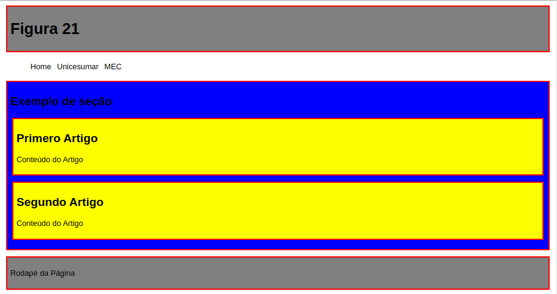

# Estrutura de uma página em HTML 5


> Fonte: CESAR, T. HTML5 e CSS3. In: CESAR, T. **Programação front end**. 3.ed.rv. Maringa, PR: Centro Universiário de Maringá, 2019. p. 54

## Exemplo


> Fonte: CESAR, T. HTML5 e CSS3. In: CESAR, T. **Programação front end**. 3.ed.rv. Maringa, PR: Centro Universiário de Maringá, 2019. p. 63-65

# Passos para construção de sites

1. Elabore o conteúdo que o site terá por escrito, pode ser no bloco de notas ou a mão
2. Fazer o wireframe do site no papel
3. Planejar o wireframe do site em uma ferramenta para construção de wireframe (Mockflow)
4. Planejar as cores em uma ferramenta para construção de cores (Adobe Color)
5. Planejar as fotes que serão usadaas na construção do site
6. Começar a programar o site fazendo o seu corpo em html
7. Declarar as variáveis globais no root em css e resete os padding e margin para 0
   
Você já parou para pensar como funciona um projeto na internet e quais são os passos
mais comuns para a sua construção?

Vamos supor uma coisa bem simples: **um site na internet com a página principal e um
formulário de contato.**

O primeiro passo de tudo em um projeto é a construção de alguma documentação
para conseguir transcrever de forma visual ou textual qual a ideia do cliente sobre o
projeto que ele demanda. Geralmente, vamos nos utilizar de briefings como documentação principal em um site. Na internet, existem vários modelos de **briefings**, caso queira passar a usar.

Em seguida, iremos compor a **identidade visual** deste projeto, escolher cores, desenvolver logotipo e elementos principais do site para apresentar ao cliente e definir a melhor proposta de identidade visual. Este processo de prova consiste em uma pesquisa geralmente em empresas do porte do cliente, concorrentes ou projetos semelhantes
podendo ser inclusive fora do Brasil. O cliente tendo esta definição passaremos para a
produção. Até esta etapa nada mais fizemos do que arquitetos e engenheiros fazem em
novos projetos.

Com tudo definido, um web designer ou designer poderá definir como será o **layout da página**, ou seja, sua estrutura, posicionamento e tipografia dos títulos e elementos textuais. Normalmente, um web designer faz uso nesta etapa de programas como Adobe Photoshop ou Ilustrator e costuma entregar uma imagem mesmo no formato JPEG ou o arquivo original do projeto para que seja dado prosseguimento ao restante do projeto. Um novo aceite do cliente, é obtido.

Até aqui, destaquei três etapas e nenhuma ainda envolvendo código. Projetos de sites, por exemplo, até este momento tem aproximadamente 40% de sua execução já concluída e os próximos passos serão a **diagramação** e a **programação backend**.

A **diagramação** consiste em analisar todo o layout desenvolvido pelo webdesigner e
transcrever para HTML e CSS (se necessário também Javascript para componentes de
interação com usuário) ainda tudo de **forma estática** (fixa). Será possível com o HTML
desenvolvido ver no navegador como o trabalho ficou e já realizar os ajustes necessários
caso sejam identificados. Este trabalho em equipes maiores, geralmente, é feito por um
**desenvolvedor front-end** que possui muitas habilidades com a parte de programação
visual se é que assim podemos chamar.

Com tudo pronto, chegou a vez do **programador!** Colocar tudo em um **servidor web
local** primeiro, transformar os arquivos HTML e PHP e fazer o recebimento do formulário
de contato e envio para o e-mail do cliente. O programador ainda faz os **testes** nas páginas e verifica se tudo está em perfeito estado. Organiza os documentos em pedaços menores para facilitar a manutenção e em seguida coloca finalmente em **produção**, ou seja, em um servidor final no domínio do cliente, que poderia ser por exemplo: <http://www.meusite.com.br>.

Parece que o programador backend fez pouco para um projeto assim, mas a responsabilidade e as tarefas aumentam sempre conforme o tamanho do projeto. O trabalho do desenvolvedor backend é muito maior em sistemas para internet e aplicações, representando mais de 60% do projeto geralmente.

Em **empresas menores**, no entanto, o desenvolvedor faz o trabalho do webdesigner, do frontend e do backend e isso, junto, é praticamente 90% do projeto, quando não é o próprio desenvolvedor que faz tudo, até o contato com o cliente, o que é fácil de detectar que é um problema muito relevante manter todo o processo focado apenas em um profissional.

Em **empresas maiores** em que o projeto é bem dividido entre as funções, qualidades são muito exigidas de cada papel, enquanto em empresas menores o que mais é exigido de seus profissionais é o conhecimento amplo das tecnologias para poder exercer razoavelmente todos os papéis.

Depois de pronto, fica apenas para a empresa ou o profissional o suporte ao cliente por atendimentos e consequentes **manutenções no projeto**. Um projeto ainda que simples passou pela mão de diversas pessoas ou papéis e prova que não existe projeto simples para a internet. Este processo varia de empresa para empresa, mas o mais praticado dentro de empresas e agências para websites é baseado neste fluxo. Você pode melhorá-lo ou adaptá-lo a sua realidade.

Agora chegou sua vez! A partir de agora, você poderá definir o seu processo e até mesmo começar alguns projetos pessoais com base em um processo bem definido para entender o quanto antes como funciona um projeto web do começo ao fim. Da venda
com o cliente até a entrega e suporte. A emoção de colocar os primeiros sites (e projetos) no ar não tem preço.

> Fonte: HERBERT, R. B. Introdução ao PHP. In: HERBERT, R. B. **Programação back end I**. 22.ed.rv. Maringa, PR: Centro Universiário de Maringá, 2019. p. 79-80

# Licença
Veja ```licença``` para mais informações.

# Contatos
* 21974248505
* 21980178229
* https://www.linkedin.com/in/jonatan-renan/
